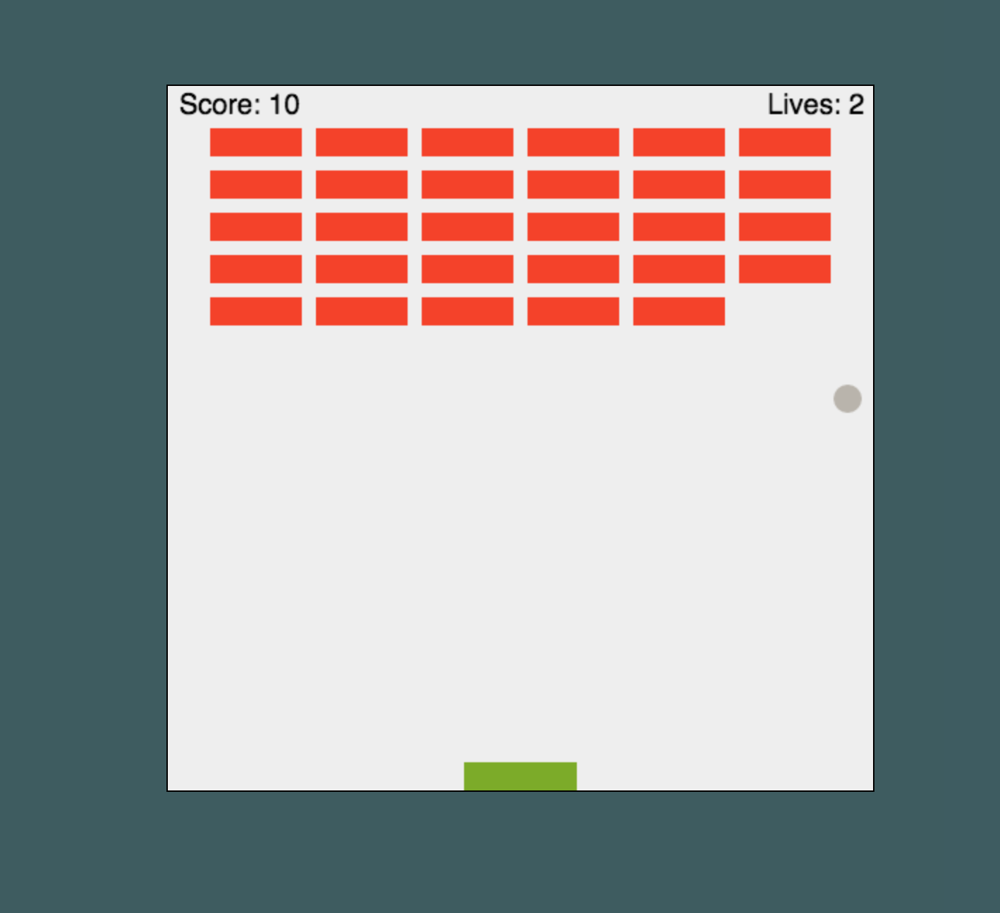
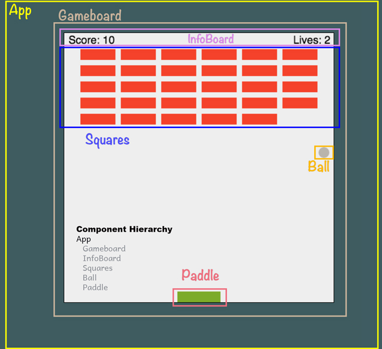

This _paddle ball_ game was bootstrapped with [Create React App](https://github.com/facebookincubator/create-react-app)
 on July 28, 2018.
 
The _static_site_ folder is the game developed with JavaScript following the tutorial at [MDN]("https://developer.mozilla.org/en-US/docs/Games/Tutorials/2D_Breakout_game_pure_JavaScript").

## Table of Contents

- [Project Goals](#project-goals)
- [Project Developement Plan](#dev-plan)
- [React Component Sketch](#component-sketch)

## Project Goals
Take the JavaScript-developed Paddle Ball game and refactor it using React JS.

## Development Plan
- Sketch out Components and Component Hierarchy

- Create components and move HTML, CSS and JavaScript over to the component files

